# Index des Captures d'Écran 📸

Ce fichier répertorie toutes les captures d'écran utilisées dans le rapport.

## 📌 Figure 1: Topologie de l'entreprise {#fig-topologie-entreprise}
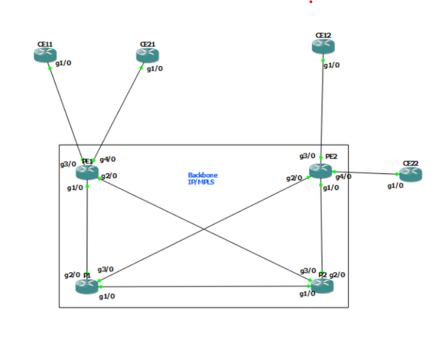

## 📌 Routage OSPF de Backbone IP/MPLS {#fig-routage-ospf}
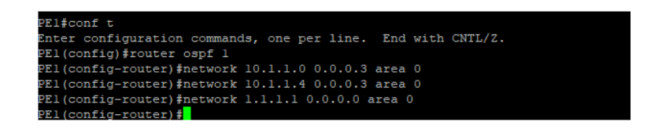

## 📌 Configuration MPLS {#fig-config-mpls}
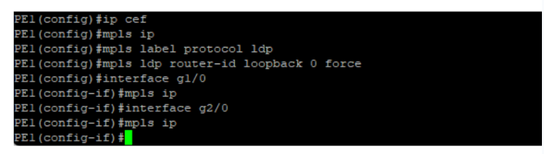

## 📌 Configuration VRF {#fig-config-vrf}
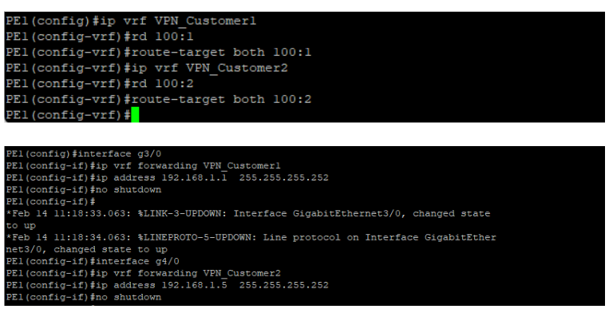

## 📌 Vérification du routage OSPF  
- **Table de voisinage OSPF** {#fig-voisinage-ospf}  
  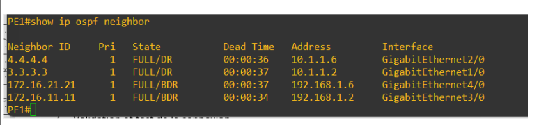  
- **Table de routage OSPF** {#fig-routage-ospf-table}  
  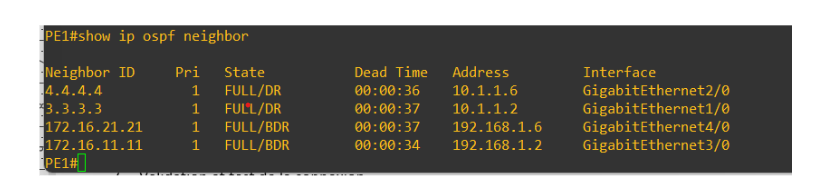

## 📌 Vérification du VPN MPLS  
- **Affichage des voisins PE1** {#fig-voisins-pe1}  
  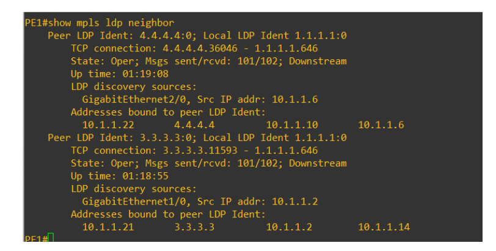  
- **Vérification de la LFIB** {#fig-lfib}  
  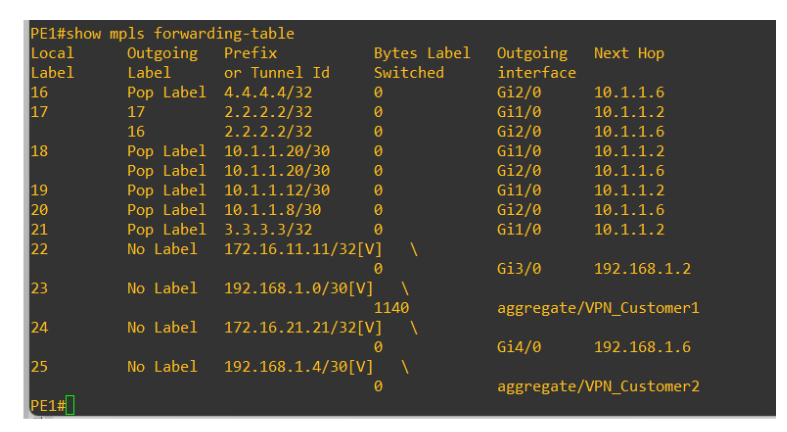

## 📌 Figure 9: Affichage des bindings des labels MPLS récupérés par LDP {#fig-bindings-mpls}  
  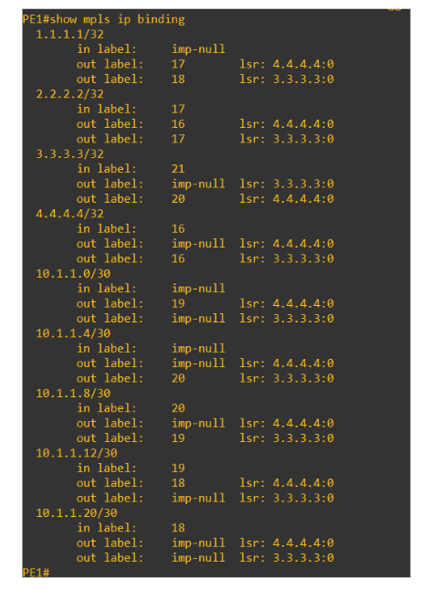

## 📌 Vérification du BGP  
- **Customer 1 - PE1** {#fig-bgp-customer1-pe1}  
  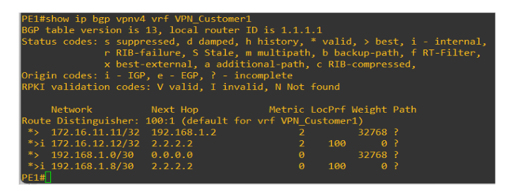  
- **Customer 1 - PE2** {#fig-bgp-customer1-pe2}  
  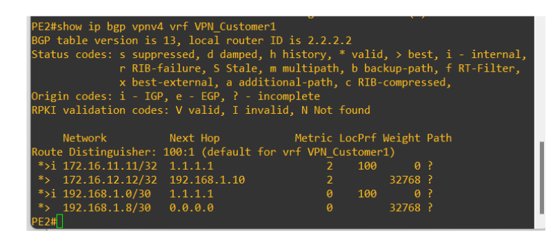  
- **Customer 2 - PE1** {#fig-bgp-customer2-pe1}  
  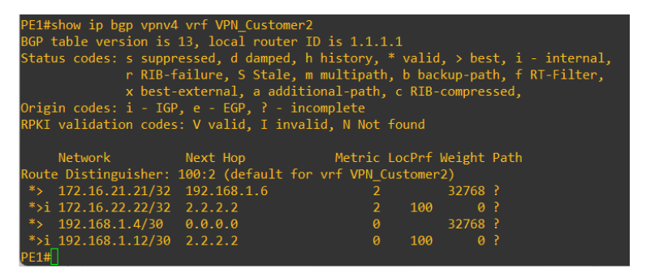  
- **Customer 2 - PE2** {#fig-bgp-customer2-pe2}  
  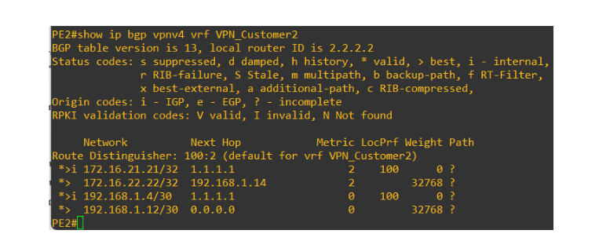

## 📌 Table de routage VRF  
- **VPN Customer 1 - PE1** {#fig-vrf-customer1-pe1}  
  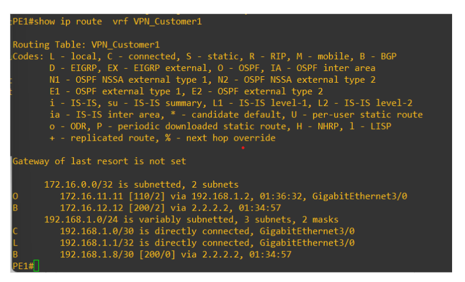  
- **VPN Customer 1 - PE2** {#fig-vrf-customer1-pe2}  
  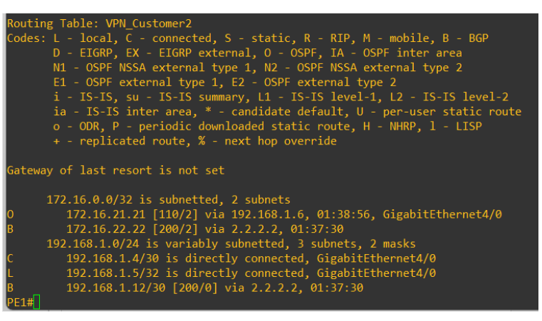  
- **VPN Customer 2 - PE1** {#fig-vrf-customer2-pe1}  
  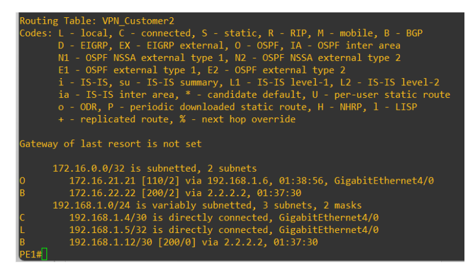  
- **VPN Customer 2 - PE2** {#fig-vrf-customer2-pe2}  
  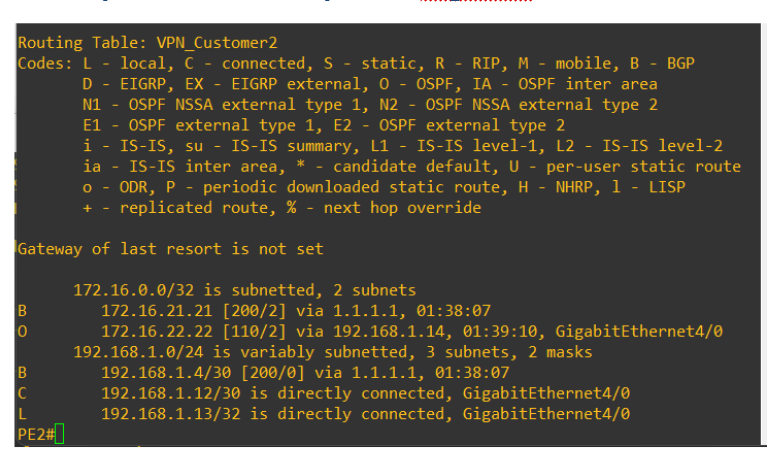

## 📌 Test de connectivité entre clients  
- **Table de routage CE11** {#fig-table-ce11}  
  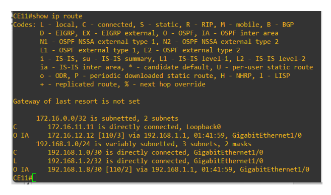  
- **Table de routage CE12** {#fig-table-ce12}  
  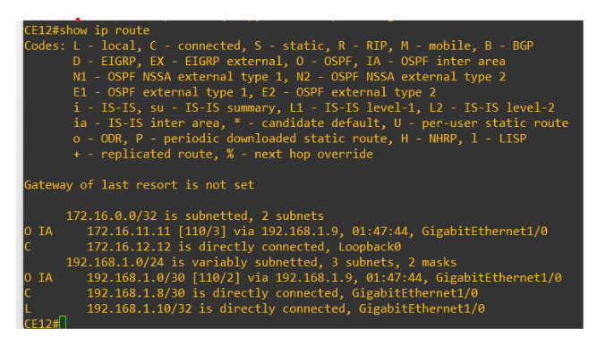  
- **Connexion CE11 → CE12** {#fig-connexion-ce11-ce12}  
  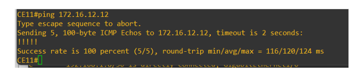  
- **Connexion CE12 → CE11** {#fig-connexion-ce12-ce11}  
  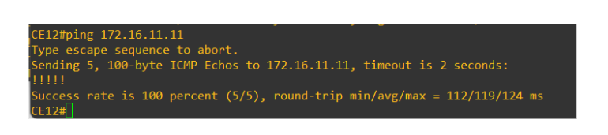  
- **Table de routage CE21** {#fig-table-ce21}  
  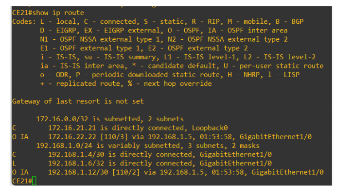  
- **Table de routage CE22** {#fig-table-ce22}  
  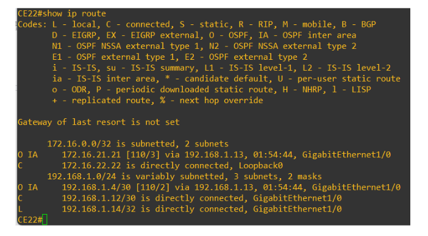  
- **Connexion CE21 → CE22** {#fig-connexion-ce21-ce22}  
  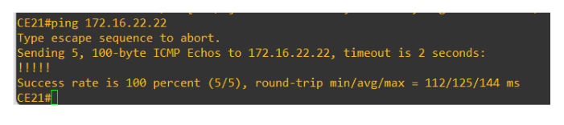  
- **Connexion CE22 → CE21** {#fig-connexion-ce22-ce21}  
  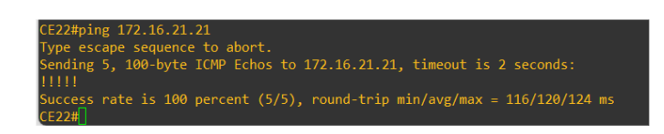

---

## 🔗 **Lien vers le projet GitHub**  
👉 [Mon Dépôt GitHub](https://github.com/Ghofranela/Network_project)
